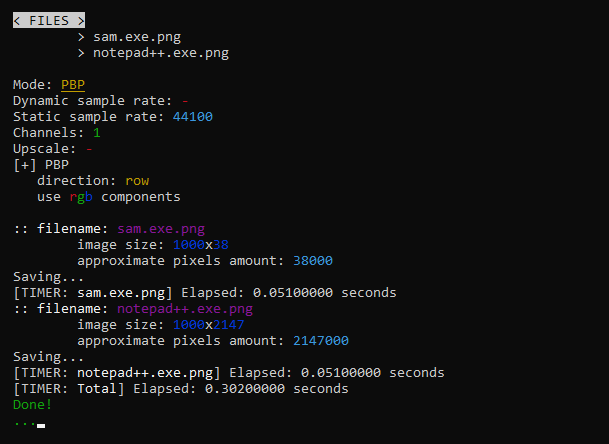

# Version 1.0.3

## HEXng


- Converts _any file_ into _.png_ with corresponding name
- Options source: keyboard

## Wavorizer



- Converts _.png, .jpeg, .jpg_ ( further .{image} ) into _.wav_ in 2 different modes:
1.  PBP [ Pixel by pixel ]
    - Writes RGB components as .wav amplitudes
    - Options: 
      
option             | arg  | description
-------------------|------|------------
sum_rgb_components | bool | uses sum of R+G+B instead of separate RGB components
direction          | str  | **row** - read .{image} row by row; **column** - read .{image} column by column 

1. ISM [ Inverse spectrogram method ]
    - Reads entire .{image} as spectrogram and writes it as _.wav_ amplitudes
    - Must be suitable for many images, but very small and messy images will produce messy result
    - Options: 

option         | arg  | description
---------------|------|------------
use_noise      | bool | whether noise should be applied to the image or not
noise_strength | str  | strength of the applied noise
 
- Other options:

option             | arg  | description
-------------------|------|------------
sample_rate_locked | bool | if true, uses `sample_rate` value, otherwise sample rate will be computed automatically using linear remapping
sample_rate        | int  | target sample rate of the output .wav file
channels           | int  | mono or stereo
image_scale        | int  | if this value is other than 1, then image will be prescaled using this scale factor

- Options source: config file

> **Note:**
> Current max image size is 1e8 ( =  _1 000 000 00_ )
> .{image} with **width** x **height** > 1e8 will be skipped.
> This value is also used for remapping as max value of initial range.
> Look at the sources if you really want to edit it:
> Wavorizer.py :: MAX_IMAGE_LIN_SIZE = 1e8

## Complete config structure ( Default values ):
``` JSON
{
    "mode": "PBP",
    "channels": 1,
    "sample_rate_locked": true,
    "sample_rate": 44100,
    "image_scale": 1,
    "PBP": {
        "sum_rgb_components": false,
        "direction": "row"
    },
    "ISM": {
        "use_noise": true,
        "noise_strength": 0.5
    }
}
```


## Examples

**HEXng - Notepad++.exe ~ columns: 1000**
 

**Wavorizer - Logo**
 

**Wavorizer - 2B2T Spawn**
 


