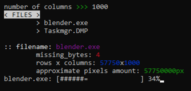

# Version 1.0.1

## HEXng



- Simply converts _any file_  into .png with corresponding name;
- Only accepts number of columns  [100 and higher] in output .png files as user input:
`number of columns >>> 1000`

## Wavorizer


- Takes no user input, all settings inside config.json;
- Can convert .png, .jpeg, .jpg (further .{image}) into .wav in different modes:
1.  PBP [Pixel by pixel]
    - Write RGB components as .wav amplitudes 
    - Settings: 
      - `pixel_sum_method` [bool]: use R+G+B value instead of separate RGB values;
      - `direction` [`row` or `column`]:
       `row`: read .{image} row by row
       `column`: read .{image} column by column

2. ISM [Inverse spectrogram method]
    - Read entire .{image} as spectrogram and _try_ to recreate it as .wav amplitudes;
    - Must be suitable for many images, but very small and messy images will produce the same result;
    - Settings: 
      - `use_scanlinees` [bool]: should it draw scanlines or not?
      - `scanlines_distance` [int]: distance between each scanline
 
- Other options:
  - `rate_locked` [bool]: if true, use `sample_rate` value, otherwise
    sample rate will be computed automatically using linear remapping from
    number of image pixels

  - `sample_rate` [int]: target sample rate for the .wav file. Default: _44 100_
  - `channels` [int]: mono or stereo
  - `scale` [int]: if this value is other than 1, then image will be prescaled 
    using this scale factor

> **Note**
> Current max image size is 1e8 aka _1 000 000 00;_ 
> .{image} with **width** x **height** > 1e8 will be skipped
> This value is also used for remapping as max value of initial range
> View sources if you really want to edit it:
> Wavorizer.py :: 29: MAX_IMAGE_LIN_SIZE = 1e8

## Complete config structure:
```json
"mode": ["PBP"/"ISM"],
"channels": [1/2],
"rate_locked": [True/False],
"sample_rate": [512..256000],
"image_scale": [1..10],
"PBP":
     "pixel_sum_method": [True/False],
    "direction": ["row"/"column"]
"ISM":
    "use_scanlines": [True/False],
    "scanlines_distance": [8..64]
```


## Examples

**HEXng**: `Notepad++.exe [column: 1000]`
 

**Wavorizer**: `Logo [scanlines: 12]`
 

**Wavorizer**: `2B2T Spawn`
 


